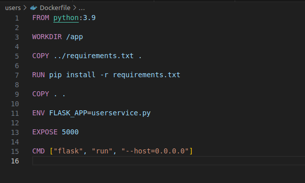
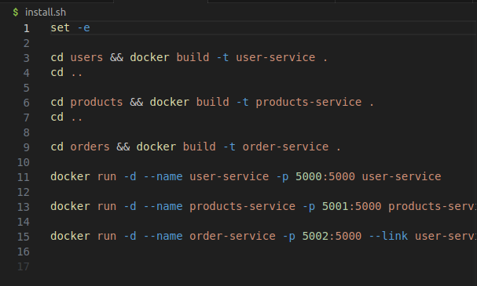
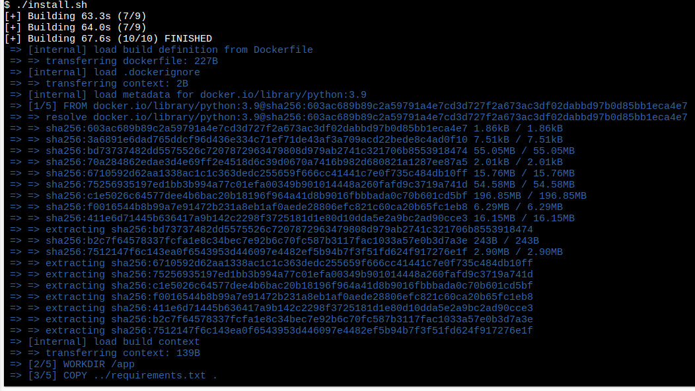
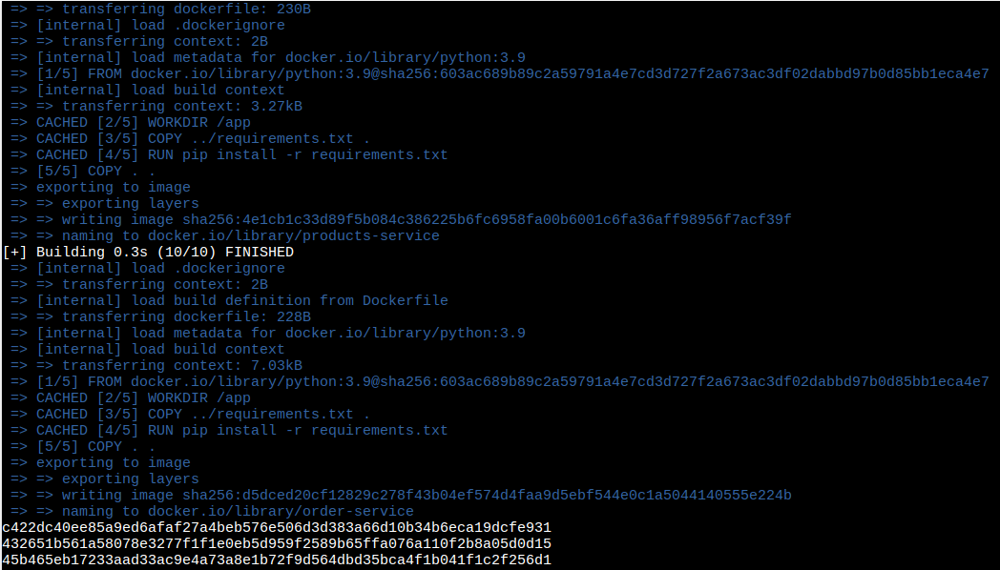
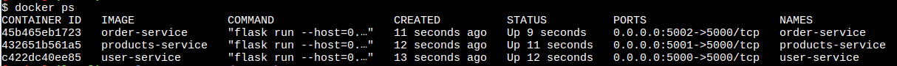
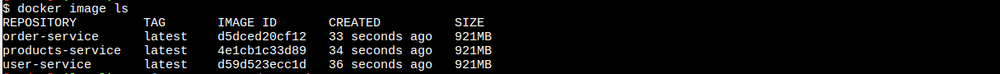
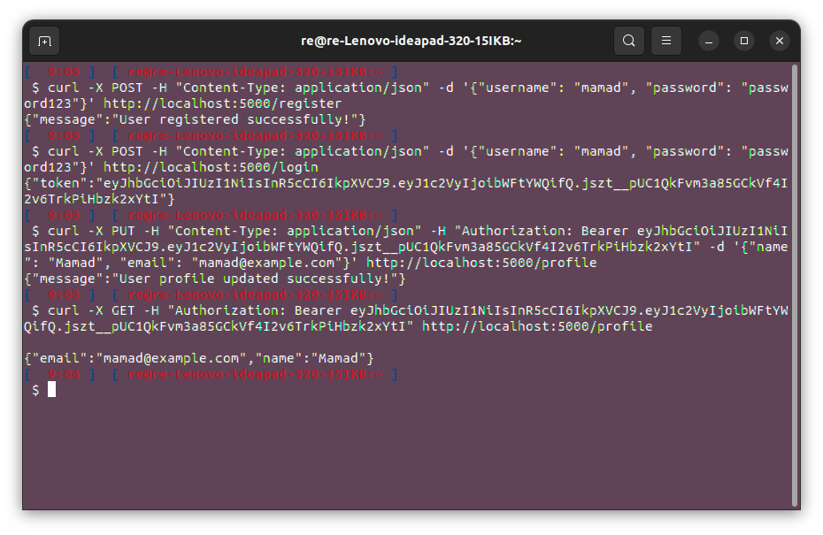
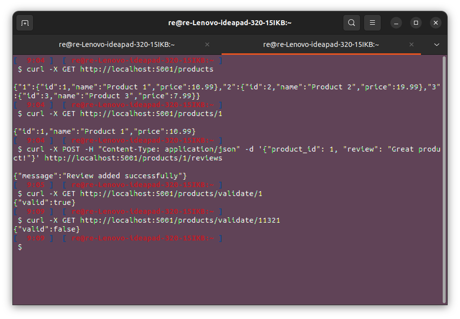
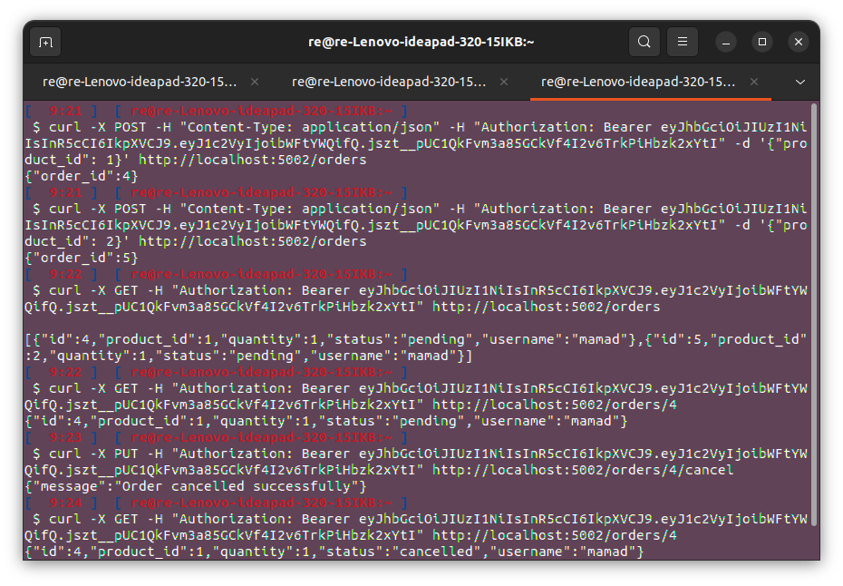

# آزمایش نهم آزمایشگاه مهندسی نرم‌افزار
- نونا قاضی‌زاده ۹۸۱۷۱۰۰۷
- رضا عبداله‌زاده ۹۷۱۰۶۱۳۲
## توضیحات آزمایش

در این آزمایش ما یک معماری مایکروسرویس را شامل سه سرویس کاربر، محصول و سفارش توسعه دادیم به طوری که در کنار هم ساختار یک فروشگاه اینترنتی را نمایش میدهند.

## جزئیات پیاده‌سازی
### سرویس کاربر

در سرویس کاربر، کلاینت میتواند با apiهای موجود
کاربر جدید بسازد، به آن کاربر لاگین کند و پروفایل خود را دیده یا آپدیت کند.
تمام مراحل احراز هویت به کمک jwt token انجام شده و از متد 
دکوریتور token_required برای بررسی و بازگرداندن کاربر مربوط به هر توکن استفاده می‌شود.
کاربرها در یک دیکشنری نگه‌داری میشوند.

یک api با نام validate_login نیز وجود دارد که سرویس‌های دیگر میتوانند با صدا زدن آن از احراز هویت کلاینت‌ها مطمئن شوند.

### سرویس محصول

در این بخش محصولات که در یک دیکشنری پایتون نگه‌داری میشوند میتوان
تمام محصولات یا یک محصول خاصی را گرفت، به محصولی خاص یک نظر اضافه کرد و همینطور apiای به نام validate_product 
قرار  گرفته است که با آن سرویس‌های دیگر بتوانند از صحت وجود یک محصول اطمینان حاصل کنند.

### سرویس سفارش

در این سرویس با در اختیار داشتن توکن هر کاربر میتواند، سفارش‌های خود را ببیند، جزئیات یک سفارش خاص را ببیند و سفارش جدید ثبت کند یا سفارشات قبلی خود را کنسل کند.
این کار با ارسال درخواست به سرویس کاربر و سرویس محصول برای اطمینان از اهراز هویت و صحت محصول بکار میرود.

## دیپلویمنت
### توسعه‌ی Dockerfileها
برای هر یک از سرویس‌های داکر فایل جداگانه توسعه یافته است به طوری که روی پورت 5000 اجرا می‌شوند.
به کمک pip ابتدا نیازمندي‌ها نصب شده و سپس هر یک به کمک flask اجرا می‌وشند.

### بیلد و اجرا
در این بخش به کمک فایل install.sh، سه سرویس بیلد شده و اجرا می‌شوند.
به ترتیب پورت‌های خودرا روی 5000، 5001 و 5002
فوروارد میکنند و ازین پس قابل استفاده هستند.

فایل install.sh:

مراحل بیلد و اضافه کردن و اجرا کردن imageهScreenshot from 2023-06-02 22-34-00

`docker ps` و `docker image ls` :

## آزمایش برنامه

در اینجا به ازای هر api در هر سرویس از curl برای آزمایش برنامه استفاده می‌کنیم.

سناریو‌ی ثبت‌نام کاربر و مشاهده و تغییر پروفایل:

سناریوی بررسی و دیدن محصولات:

سناریوی ثبت و کنسل کردن سفارش:

